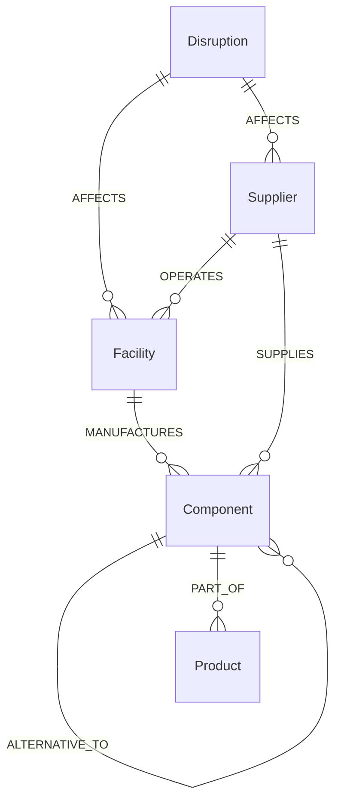

# NexusChain — Graph-Powered Supply Chain Vulnerability & Dependency Navigator

[](https://console.cognodb.com)
[](https://opencypher.org)
[](https://neo4j.com/docs/python-manual/current/)
[](https://fastapi.tiangolo.com)

A managed graph database application built for the **Wexa AI CognoDB Take-Home Assignment**. **NexusChain** models multi-tier global semiconductor and hardware manufacturing supply chains to identify single points of failure (SPOFs), compute multi-hop disruption blast radii, and discover alternative supplier pathways in real-time.

---

## 1. Why a Graph Database?

In global manufacturing, supply chains form complex, multi-tiered directed networks rather than flat tabular rows.

### The Relational Database Problem
Answering queries such as:
> *"If Supplier X in Tainan experiences a port disruption, which end-products across all customer fulfillment orders are impacted 4 tiers down, and what total revenue is exposed?"*

In a Relational SQL database (e.g., PostgreSQL/MySQL), answering this requires:
1. Deeply nested `JOIN` queries across multiple tables (`suppliers JOIN facilities JOIN components JOIN sub_assemblies JOIN products`).
2. Expensive `WITH RECURSIVE` Common Table Expressions (CTEs).
3. Exponential growth in query execution latency as path depth $N$ increases, because SQL evaluates joins via dynamic table scans and index lookups at runtime ($O(|V| \times |E|)$).

### The CognoDB Graph Advantage
- **Index-Free Adjacency**: CognoDB stores relationships as direct memory references between nodes. Traversing from a node to its neighbors executes in $O(1)$ constant time per hop.
- **Declarative openCypher Traversals**: Path queries spanning 1 to 5 hops (e.g. `MATCH path = (s:Supplier)-[:SUPPLIES|REQUIRES|PART_OF*1..5]->(p:Product)`) execute in sub-milliseconds regardless of total graph size.
- **Flexible Schema**: Real-world supply networks frequently change relationships, add new component tiers, or introduce alternative supplier options without requiring destructive SQL table schema migrations (`ALTER TABLE`).

---

## 2. Graph Data Model & Schema



### Node Labels
- **`Supplier`**: `id`, `name`, `tier` (1, 2, 3), `country`, `riskScore` (0-100), `status`
- **`Facility`**: `id`, `name`, `city`, `country`, `facilityType`
- **`Component`**: `id`, `name`, `sku`, `category`, `criticality` (CRITICAL/HIGH/MEDIUM), `leadTimeDays`
- **`Product`**: `id`, `name`, `sku`, `category`, `retailPrice`, `marginPct`
- **`Disruption`**: `id`, `title`, `type`, `severity` (CRITICAL/HIGH), `impactedRegion`

### Relationship Types
- `(:Supplier)-[:OPERATES]->(:Facility)`
- `(:Facility)-[:MANUFACTURES]->(:Component)`
- `(:Supplier)-[:SUPPLIES {unitCost: Float, leadTimeDays: Int}]->(:Component)`
- `(:Component)-[:REQUIRES {quantity: Int}]->(:Component)` *(Sub-assembly dependency)*
- `(:Component)-[:PART_OF {quantity: Int}]->(:Product)`
- `(:Component)-[:ALTERNATIVE_TO {switchLeadTimeDays: Int, costDeltaPct: Float}]->(:Component)`
- `(:Disruption)-[:AFFECTS]->(:Facility | :Supplier)`

---

## 3. CognoDB Cloud Setup & Connection Guide

### Step 1: Provision CognoDB Instance
1. Go to [https://console.cognodb.com/signup](https://console.cognodb.com/signup) and create a free account.
2. Create a free **c0** instance and select your preferred region (provisions in < 1 minute).
3. Copy your connection details:
   - **Connection URI**: `bolt+s://<instance-id>.databases.cognodb.cloud`
   - **Username**: `cognodb`
   - **Password**: *(Saved password generated by CognoDB Console)*

### Step 2: Configure Environment Variables
Create a `.env` file in the project root:

```env
COGNODB_URI=bolt+s://<your-instance-id>.databases.cognodb.cloud
COGNODB_USER=cognodb
COGNODB_PASSWORD=<your-generated-password>

PORT=8000
HOST=0.0.0.0
```

### Step 3: Run Database Seeder
Execute the automated dataset loader using the official Neo4j Python driver:

```bash
python scripts/seed.py
```

*Output:*
```text
Connecting to CognoDB Cloud at bolt+s://...
Purging existing nodes & relationships...
Seeding Supplier, Facility, Component, Product, and Disruption nodes...
Creating OPERATES, MANUFACTURES, SUPPLIES, REQUIRES, PART_OF, and ALTERNATIVE_TO relationships...
SEEDING COMPLETE! Database now contains 19 nodes and 23 relationships.
```

---

## 4. Main openCypher Queries Explained

All queries use strict parameter binding via the official Neo4j driver (zero string concatenation).

### Query 1: Multi-Hop Risk Blast Radius (1 to 5 Hops)
*Traverses variable-length paths from a disrupted supplier down to affected end-market products.*

```cypher
MATCH (s:Supplier {id: $supplier_id})
MATCH path = (s)-[:OPERATES|SUPPLIES|MANUFACTURES|REQUIRES|PART_OF*1..5]->(p:Product)
RETURN s.name AS supplierName, 
       p.name AS productName, 
       p.retailPrice AS revenueExposed, 
       length(path) AS hops
```

### Query 2: Single Point of Failure (SPOF) Component Discovery
*Discovers critical components dependent on exactly one supplier across all tiers.*

```cypher
MATCH (c:Component)
OPTIONAL MATCH (s:Supplier)-[:SUPPLIES]->(c)
WITH c, count(s) AS supplierCount, collect(s.name) AS suppliers
WHERE supplierCount = 1 AND c.criticality IN ['CRITICAL', 'HIGH']
OPTIONAL MATCH (c)-[:PART_OF|REQUIRES*1..3]->(p:Product)
RETURN c.name AS component, 
       c.sku AS sku, 
       c.criticality AS criticality, 
       suppliers, 
       collect(DISTINCT p.name) AS affectedProducts
```

### Query 3: Shortest Alternative Mitigation Pathway
*Identifies alternative qualified components and backup suppliers during supplier outages.*

```cypher
MATCH (c:Component {id: $component_id})-[r:ALTERNATIVE_TO]-(alt:Component)
MATCH (s:Supplier)-[:SUPPLIES]->(alt)
RETURN c.name AS primaryComponent, 
       alt.name AS alternativeComponent, 
       s.name AS supplier, 
       r.switchLeadTimeDays AS leadTime, 
       r.costDeltaPct AS costDelta
```

---

## 5. Local Setup & Execution Instructions

### Prerequisites
- Python 3.10+
- Node.js (Optional for static assets)

### Quickstart

```bash
# 1. Clone repository
git clone https://github.com/SakthiKumarSK/cognodb-supply-chain-graph.git
cd cognodb-supply-chain-graph

# 2. Install dependencies
pip install -r requirements.txt

# 3. Configure credentials in .env
cp .env.example .env

# 4. Seed CognoDB Database
python scripts/seed.py

# 5. Start Application Server
python app/main.py
```

Open your browser at `http://localhost:8000`.

---

## 6. Architecture & Code Structure

```text
cognodb-supply-chain-graph/
├── app/
│   ├── __init__.py
│   ├── main.py              # FastAPI app server & REST endpoints
│   ├── config.py            # Environment variable configuration
│   ├── database.py          # Neo4j Driver connection manager & session handler
│   ├── graph_queries.py     # Parameterized openCypher query repository
│   └── models.py            # Pydantic API response models
├── static/
│   ├── index.html           # Interactive visual dashboard
│   ├── css/
│   │   └── app.css          # Visual styles & canvas grid theme
│   └── js/
│       └── app.js           # vis-network graph controller & Inspector UI
├── scripts/
│   └── seed.py              # Database seeder script
├── .env.example             # Connection credentials template
├── requirements.txt         # Project dependencies
└── README.md                # Submission documentation
```

---

## 7. Submission Checklist & Guidelines

- **Repository**: GitHub Repository URL
- **Email To**: `hr@wexa.ai`
- **Subject**: `CognoDB Assignment 2 – <Your Name>`
- **Live Instance Notice**: CognoDB Cloud instance kept running for evaluation.
